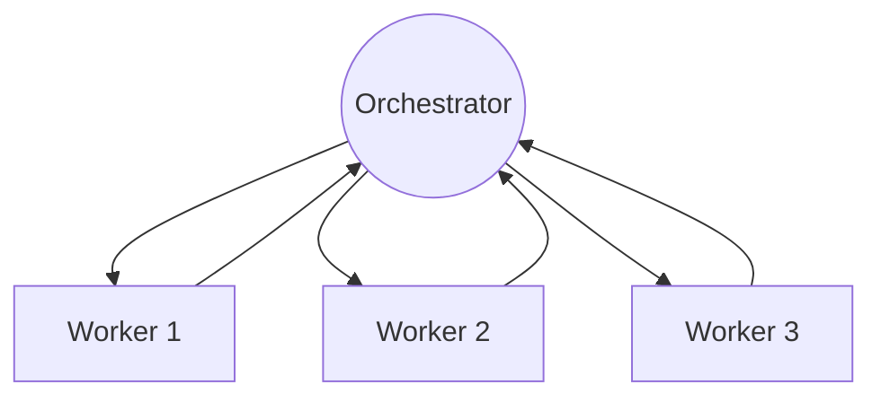
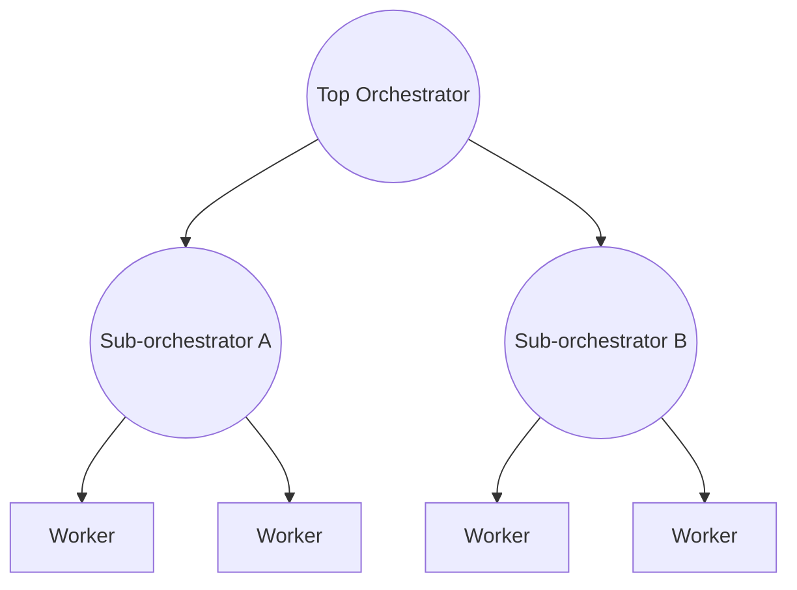
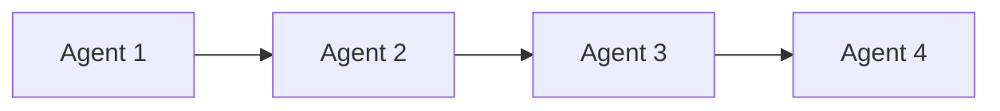
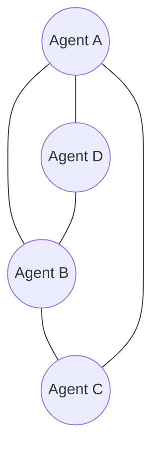
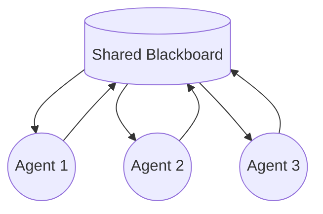
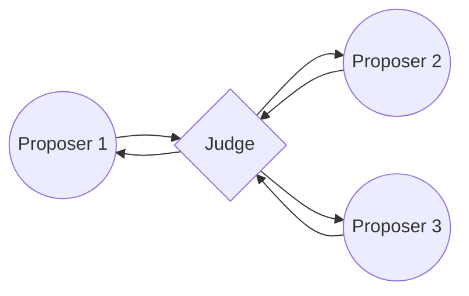

# Awesome Agent Reliability 

> Securing, looping, orchestrating, and building AI agents that hold up in production.

A curated list of resources for making autonomous AI agents reliable — from the single agent running unattended in a loop, to graphs of agents handing work to each other, to the security boundary around the tools and credentials they wield, to the Rust crates for building fast, memory-safe agent runtimes. Four parts, in the order most teams hit them:

1. **[Loops](#loops)** — one agent, running itself in self-feeding cycles (Ralph and beyond).
2. **[Multi-Agent / Graph Orchestration](#multi-agent--graph-orchestration)** — more than one agent, wired together on purpose.
3. **[Security](#security)** — the agent attack surface: configs, runtime, tools, MCP, and prompt injection.
4. **[Rust](#rust)** — building the agents themselves in Rust.

*This list merges and replaces awesome-loop-engineering, awesome-graph-engineering, and awesome-rust-agentics, which were folded in here.*

## Contents

- [Loops](#loops)
  - [Loop Canon](#loop-canon)
  - [Patterns & Techniques](#patterns--techniques)
  - [Loop Runners & Orchestrators](#loop-runners--orchestrators)
  - [Multi-Agent Loop Systems](#multi-agent-loop-systems)
  - [Articles & Deep Dives](#articles--deep-dives)
- [Multi-Agent / Graph Orchestration](#multi-agent--graph-orchestration)
  - [Orchestration Canon](#orchestration-canon)
  - [Topology Patterns](#topology-patterns)
  - [Frameworks & Orchestrators](#frameworks--orchestrators)
  - [Handoff & Interop Protocols](#handoff--interop-protocols)
  - [State, Memory & Durable Execution](#state-memory--durable-execution)
  - [Observability & Debugging](#observability--debugging)
  - [Multi-Agent Benchmarks](#multi-agent-benchmarks)
  - [Production Case Studies](#production-case-studies)
- [Security](#security)
  - [Threat Models & Standards](#threat-models--standards)
  - [Static & Config Scanning](#static--config-scanning)
  - [Runtime Guardrails](#runtime-guardrails)
  - [Red-Teaming & Testing](#red-teaming--testing)
  - [Benchmarks & Evaluation](#benchmarks--evaluation)
  - [Prompt Injection & Tool Poisoning](#prompt-injection--tool-poisoning)
  - [MCP Security](#mcp-security)
  - [Identity, Authorization & Access](#identity-authorization--access)
  - [Agent Supply Chain & Provenance](#agent-supply-chain--provenance)
  - [Operational Security](#operational-security)
- [Rust](#rust)
  - [Agent Frameworks](#agent-frameworks)
  - [LLM Inference & ML](#llm-inference--ml)
  - [LLM Clients & Providers](#llm-clients--providers)
  - [Model Context Protocol](#model-context-protocol)
  - [Data, Memory & Vectors](#data-memory--vectors)
  - [Learning](#learning)
- [Related Lists](#related-lists)
- [Contributing](#contributing)

---

## Loops

> Prompt engineering → context engineering → harness engineering → **loop engineering**.

Designing autonomous AI agent loops — running coding agents in self-feeding cycles: loop patterns, runners, orchestrators, memory strategies, stop conditions, and safety.

*"I don't prompt Claude anymore. I have loops running that prompt Claude and figure out what to do. My job is to write loops."* — Boris Cherny, Anthropic

### Loop Canon

- [everything is a ralph loop](https://ghuntley.com/loop/) - Geoffrey Huntley's foundational essay. The bash loop that started it: allocate specs, set a goal, loop the goal.
- [how-to-ralph-wiggum](https://github.com/ghuntley/how-to-ralph-wiggum) - Huntley's reference repo for the Ralph Wiggum Technique.
- [Inventing the Ralph Wiggum Loop](https://devinterrupted.substack.com/p/inventing-the-ralph-wiggum-loop-creator) - Dev Interrupted interview with Huntley on how dumb loops + deterministic context allocation change the unit economics of code. ([podcast episode](https://linearb.io/dev-interrupted/podcast/inventing-the-ralph-wiggum-loop))
- [ralph-wiggum.ai](https://github.com/fstandhartinger/ralph-wiggum) - The viral loop, simplified for teams.
- [Loop Engineering](https://addyosmani.com/blog/loop-engineering/) - Addy Osmani's essay that named the discipline and gave it an anatomy: automations, worktrees, skills, connectors, sub-agents, and durable external state.
- [Stop prompting, design loops](https://x.com/steipete/status/2063697162748260627) ([archived](https://archive.ph/sOGZN)) - Peter Steinberger's one-line reframe (creator of OpenClaw): you shouldn't be prompting coding agents anymore — you should be designing loops that prompt them.
- [How the agent loop works](https://code.claude.com/docs/en/agent-sdk/agent-loop) - Anthropic's official docs on the inner loop (evaluate → tool call → result → repeat), and how to embed it in your own applications via the Claude Agent SDK with programmatic control over tools, permissions, and cost limits.

### Patterns & Techniques

- [The Ralph Wiggum Loop: Autonomous Code Generation with Fresh Context](https://www.codecentric.de/en/knowledge-hub/blog/the-ralph-wiggum-loop-autonomous-code-generation-with-a-fresh-context) - Why fresh context every iteration is the point, not a side effect: filesystem as memory, one task per iteration, exit for a clean window.
- [Agentic Engineering Protocols: The Ralph Wiggum Loop](https://dwmkerr.com/ralph-wiggum-loop/) - Loop as protocol: spec comparison, IMPLEMENTATION_PLAN.md as prioritized queue, commit-per-iteration.
- [The Ralph Loop: How Recursive AI Agents Actually Work](https://thomas-wiegold.com/blog/ralph-loop-how-recursive-ai-agents-work/) - Mechanics of recursion via restart: plan files, DONE sentinels, retry-with-fresh-context.
- [Ralph Wiggum Loop notes](https://prg.sh/notes/Ralph-Wiggum-Loop) - Condensed field notes on the loop lifecycle.
- [Agentic Coding Framework: Build the Agent Loop](https://www.buildmvpfast.com/blog/harness-engineering-agent-loop-agentic-coding-framework-2026) - The progression from harness engineering to loop engineering: the harness on a timer, spawning helpers, feeding itself.

### Loop Runners & Orchestrators

- [ralph-orchestrator](https://github.com/mikeyobrien/ralph-orchestrator) - Production-minded Ralph implementation: safety limits, monitoring, cost controls, multiple backends. ([docs](https://mikeyobrien.github.io/ralph-orchestrator/))
- [ralphex](https://github.com/umputun/ralphex) - Standalone CLI that orchestrates Claude Code or Codex through implementation plans from your repo root — no IDE plugins, no cloud.
- [ralph-loop-agent](https://github.com/vercel-labs/ralph-loop-agent) - Vercel Labs' "Continuous Autonomy for the AI SDK."
- [continuous-claude](https://github.com/AnandChowdhary/continuous-claude) - Ralph loop with PRs: create PR → wait for checks → merge → repeat. CI/CD-shaped autonomy.
- [ralph](https://github.com/snarktank/ralph) - Loop until every PRD item is complete.
- [ralph-loop](https://github.com/PageAI-Pro/ralph-loop) - Long-running task-list loop; AI coding for days at a time.
- [autoloop](https://github.com/yaoshengzhe/autoloop) - Autonomous-iteration plugin for agentic tools: keeps running until the task is done.
- [agentic-loop](https://github.com/allierays/agentic-loop) - RALPH + PRD-driven development toolkit; `npx agentic-loop run`.
- [loop-maker](https://github.com/EricTechPro/loop-maker) - Interviews you, then scaffolds a self-running loop with verifier, state file, and human gate. Cross-harness (Claude Code / Codex / Hermes / OpenClaw).
- [loopgen-rs](https://github.com/adventurewave-labs/loopgen-rs) - Agentic loop runner for Claude Code, in Rust. *(ours)*
- [yylo](https://github.com/yylo-dev/yylo) - CLI that loops coding agents through one task per worktree to a receipt-backed, validated commit — Ralph-style autonomy with typed task, merge, and release gates; Pi and Codex as engines.

### Multi-Agent Loop Systems

- [gastown](https://github.com/gastownhall/gastown) - Gas Town, via Steve Yegge: if Ralph is one agent looping, Gas Town is a community of them — a workspace manager coordinating fleets of coding agents across tasks.
- [turbo-flow](https://github.com/marcuspat/turbo-flow) - Agentic dev environment running 60+ subagents via [Ruflo v3.5](https://github.com/ruvnet/ruflo) orchestration (by [ruvnet](https://github.com/ruvnet)); loop-native by design. *(by our founder)*

### Articles & Deep Dives

- [Claude Code Loop Engineering: Stop Prompting, Start Designing Autonomous Agent Workflows](https://www.techtimes.com/articles/318828/20260622/claude-code-loop-engineering-stop-prompting-start-designing-autonomous-agent-workflows.htm) - The case for loop engineering as its own discipline.
- [What is Ralph Loop? A New Era of Autonomous Coding](https://medium.com/@tentenco/what-is-ralph-loop-a-new-era-of-autonomous-coding-96a4bb3e2ac8) - Accessible introduction.
- [Ralph Wiggum CLI](https://deepakness.com/raw/ralph-cli/) - Notes on Huntley's CLI packaging of the technique.
- [Top Agent Harnesses](https://aimultiple.com/agent-harness) - Survey of the harness layer your loop runs inside.

---

## Multi-Agent / Graph Orchestration

> One agent loops. More than one needs a graph — topology, handoffs, and state, engineered on purpose instead of improvised at runtime.

Designing multi-agent AI systems as graphs: the topology patterns that define who talks to whom, the frameworks and protocols that implement them, the state layer that survives a crash, and the observability to debug a graph once it's live. Single-agent loops are covered in [Loops](#loops) above; classical graph databases, graph theory, and graph neural networks aren't in scope.

*"Graphs let you encode that structure directly: the valid paths, where the model gets to choose, and where the system should enforce deterministic behavior instead of hoping the model makes the right call every time."* — Harrison Chase & Sydney Runkle, [3 Years of Graph Engineering with LangGraph](https://www.langchain.com/blog/3-years-of-graph-engineering-with-langgraph)

Roughly in the order you'll need them: pick a topology first, then the framework that implements it, then wire up handoffs, durability, and observability around it.

### Orchestration Canon

- [Building Effective Agents](https://www.anthropic.com/engineering/building-effective-agents) - The foundational split between "workflows" (LLM steps through predefined code paths) and "agents" (LLMs that direct their own control flow), plus the building-block patterns — including orchestrator-workers — most graph frameworks below now implement. *(Erik Schluntz & Barry Zhang, Anthropic, Dec 2024)*
- [How We Built Our Multi-Agent Research System](https://www.anthropic.com/engineering/multi-agent-research-system) - The production postmortem behind Claude's Research feature: a lead agent orchestrating parallel subagents, and the failure modes that only surface once a topology runs at scale. *(Anthropic, Jun 2025)*
- [When to Use Multi-Agent Systems (and When Not To)](https://claude.com/blog/building-multi-agent-systems-when-and-how-to-use-them) - The counter-argument this canon includes on purpose: splitting into multiple agents only pays off to protect context, parallelize, or specialize — most tasks are still better off single-threaded. *(Anthropic/Claude, Jan 2026)*
- [LangGraph: Multi-Agent Workflows](https://www.langchain.com/blog/langgraph-multi-agent-workflows) - The post that put names on "network," "supervisor," and "hierarchical agent teams" — vocabulary the rest of the field still uses. *(LangChain, Jan 2024)*
- [AutoGen: Enabling Next-Gen LLM Applications via Multi-Agent Conversation](https://arxiv.org/abs/2308.08155) - One of the earliest widely-cited papers to treat a multi-agent system's conversation topology as something you explicitly program, not a fixed loop. *(Wu et al., Microsoft Research, 2023)*
- [3 Years of Graph Engineering with LangGraph](https://www.langchain.com/blog/3-years-of-graph-engineering-with-langgraph) - LangGraph's own creators on why encoding a system as an explicit graph beats hoping the model improvises the right control flow. *(Harrison Chase & Sydney Runkle, Jul 2026 — brand new, not yet a classic, but directly on-topic)*

### Topology Patterns

The shapes multi-agent systems actually take in production. Frameworks in the next section implement one or more of these — pick the pattern before you pick the framework.

#### Orchestrator-Worker (Supervisor)

A central agent breaks a task into subtasks, dispatches them to specialized worker agents (often in parallel), and synthesizes their outputs into one result. The default starting topology for most production systems — see it in action under [Production Case Studies](#production-case-studies) before reaching for anything fancier.

Source: [How we built our multi-agent research system](https://www.anthropic.com/engineering/multi-agent-research-system) — Anthropic

#### Hierarchical (Manager-of-Managers)

An extension of the supervisor pattern: the top-level orchestrator delegates to entire sub-teams — each with its own supervisor and workers — instead of to individual workers directly. Useful once a single orchestrator's context window or decision surface gets overloaded.

Source: [LangGraph: Multi-Agent Workflows — "Hierarchical Agent Teams"](https://www.langchain.com/blog/langgraph-multi-agent-workflows) — LangChain

#### Sequential Pipeline

Agents run in a fixed, linear order, each consuming the previous agent's output — an assembly line of specialized transformations. The simplest topology to reason about and debug; reach for it before anything with cycles or parallel branches.

Source: [AI Agent Orchestration Patterns](https://learn.microsoft.com/en-us/azure/architecture/ai-ml/guide/ai-agent-design-patterns) — Microsoft Azure Architecture Center

#### Mesh / Peer-to-Peer (Swarm)

Agents exchange information and hand off work directly to each other with no central controller; overall behavior emerges from decentralized, local interactions. Flexible, but the hardest topology to make deterministic or debug.

Source: [Multi-agent collaboration patterns with Strands Agents and Amazon Nova](https://aws.amazon.com/blogs/machine-learning/multi-agent-collaboration-patterns-with-strands-agents-and-amazon-nova/) — AWS

#### Blackboard (Shared-State)

All agents read from and write to one shared workspace; which agent acts next is chosen by the current state of that workspace rather than a fixed order, repeating until the group converges. A good fit when the right next step genuinely depends on what's been discovered so far.

Source: [Exploring Advanced LLM Multi-Agent Systems Based on Blackboard Architecture](https://arxiv.org/abs/2507.01701) — Han & Zhang, 2025

#### Market-Based / Debate

Multiple agent instances independently propose an answer, then critique each other's reasoning over several rounds, converging through structured argument instead of one agent's single pass. Expensive — usually reserved for high-stakes reasoning, not routine tool calls.

Source: [Improving Factuality and Reasoning in Language Models through Multiagent Debate](https://arxiv.org/abs/2305.14325) — Du, Li, Torralba, Tenenbaum & Mordatch, ICML 2024

### Frameworks & Orchestrators

The SDKs that actually let you declare a topology instead of hand-rolling one. Table below is a fast scan; full entries underneath.

| Framework | Language(s) | Topology model | Maintainer |
|---|---|---|---|
| [LangGraph](https://github.com/langchain-ai/langgraph) | Python, JS/TS | Explicit state graph — nodes, conditional edges, cycles | LangChain |
| [Microsoft Agent Framework](https://github.com/microsoft/agent-framework) | Python, .NET, Go | Typed Executors wired by Edges, plus an AutoGen-style chat mode | Microsoft |
| [CrewAI](https://github.com/crewAIInc/crewAI) | Python | Role-based Crews (sequential/hierarchical) + event-driven Flows | CrewAI, Inc. |
| [OpenAI Agents SDK](https://github.com/openai/openai-agents-python) | Python, TS | Peer agents with explicit `handoff` calls | OpenAI |
| [Claude Agent SDK](https://code.claude.com/docs/en/agent-sdk/overview) | Python, TS | Hub-and-spoke — main agent spawns isolated subagents | Anthropic |
| [Google ADK](https://github.com/google/adk-python) | Python, Java, Go, Kotlin, TS | Sequential/Parallel/Loop containers + dynamic sub-agent routing | Google |
| [LlamaIndex Workflows](https://github.com/run-llama/llama-agents) | Python, TS | Event-driven steps — implicit DAG via typed events | LlamaIndex |
| [Burr](https://github.com/apache/burr) | Python | Explicit finite-state machine — Actions + Transitions | Apache (Incubating) |
| [Pydantic AI](https://ai.pydantic.dev/) (pydantic-graph) | Python | Statically-typed node graph; each node returns the next | Pydantic Services |
| [AWS Strands Agents](https://github.com/strands-agents/sdk-python) | Python, TS | Agents-as-tools, an explicit Graph mode, or an autonomous Swarm | AWS |
| [Mastra](https://github.com/mastra-ai/mastra) | TypeScript | Chained/branching step graph over typed state | Mastra |

- [LangGraph](https://github.com/langchain-ai/langgraph) - The reference implementation of "agent as state graph": nodes are functions or agents, edges (including conditional ones) route a shared typed state, with native cycles and checkpointing.
- [Microsoft Agent Framework](https://github.com/microsoft/agent-framework) - The official successor to both AutoGen and Semantic Kernel — "the next generation of both," per Microsoft. A graph-based Workflows layer of typed Executors and Edges, layered over a simpler multi-agent chat mode for looser cases.
- [CrewAI](https://github.com/crewAIInc/crewAI) - Two composable models: role-based "Crews" for sequential or manager-led delegation, and event-driven "Flows" for wiring crews and plain functions into an explicit, deterministic graph.
- [OpenAI Agents SDK](https://github.com/openai/openai-agents-python) - Agents hand off control to each other via explicit `handoff` tool calls — a delegation graph discovered at runtime — plus an agents-as-tools mode for hierarchies. Successor to Swarm; now sits underneath the broader AgentKit product.
- [Claude Agent SDK](https://code.claude.com/docs/en/agent-sdk/overview) - Not graph-based by design: a main agent loop spawns isolated subagents with their own context windows for focused subtasks — hub-and-spoke delegation rather than a declared topology. Formerly the Claude Code SDK.
- [Google Agent Development Kit (ADK)](https://github.com/google/adk-python) - Composes agents via code-defined Sequential/Parallel/Loop workflow containers plus LLM-driven dynamic routing; ADK 2.0 added an explicit graph-based workflow mode for deterministic multi-step control.
- [LlamaIndex Workflows](https://github.com/run-llama/llama-agents) - Plain functions ("steps") consume and emit typed Events; the resulting control flow forms an implicit graph, favoring async branching and loops over a declared node/edge API. Decoupled from core LlamaIndex; the former `workflows-py` repo now lives on as `llama-agents` (Llama Agents + Workflows).
- [Burr](https://github.com/apache/burr) - An explicit finite-state machine of Actions and Transitions over shared, persisted state — closer to a classic FSM than a general graph. Created by DAGWorks; now Apache Burr (Incubating).
- [Pydantic AI — pydantic-graph](https://ai.pydantic.dev/) - Each node is a type-checked Python class whose `run()` method returns the next node, giving a fully static, validated graph; sits under a simpler high-level Agent API for basic delegation.
- [AWS Strands Agents](https://github.com/strands-agents/sdk-python) - Four composable topology primitives in one SDK: agents-as-tools (hierarchical), an explicit deterministic Graph mode, an autonomous peer-collaboration Swarm mode, and human handoff. Deploys onto Amazon Bedrock AgentCore.
- [Mastra](https://github.com/mastra-ai/mastra) - The leading TypeScript-native counterpart to LangGraph/CrewAI: workflows are an explicit graph built from chained and branching step operators over typed state.

Rust-native multi-agent frameworks (AutoAgents, ADK-Rust, kowalski) are listed under [Rust › Agent Frameworks](#agent-frameworks).

### Handoff & Interop Protocols

How agents talk *across* systems and vendors, not just within one framework's process.

- [Agent2Agent Protocol (A2A)](https://a2a-protocol.org/) - Peer-to-peer, opaque agent-to-agent task delegation: agents publish capabilities via "Agent Cards" and exchange tasks/artifacts without exposing internal memory or prompts. Originally Google; now a Linux Foundation project with AWS, Cisco, IBM, Microsoft, Salesforce, SAP, and ServiceNow on its steering committee.
- [AGNTCY](https://agntcy.org/) - A broader interoperability stack around agent discovery, identity, and low-latency messaging — not a single wire protocol — meant to sit alongside MCP and A2A rather than replace them. Incubated at Cisco; now its own Linux Foundation project series.
- [Model Context Protocol (MCP)](https://modelcontextprotocol.io/) - Standardizes how a single agent connects to external tools, data, and context — agent-to-tool, not agent-to-agent. Originally Anthropic; now governed as an independent Linux Foundation project. Securing it is covered under [Security › MCP Security](#mcp-security).

*(IBM/BeeAI's Agent Communication Protocol — ACP — merged into A2A in August 2025 and no longer exists as a separate spec. If you see it referenced elsewhere, that's why it isn't listed here.)*

### State, Memory & Durable Execution

What keeps a graph's progress alive across a crash, a long wait on a human, or a redeploy — and what keeps its agents' memory alive across runs.

- [DBOS](https://docs.dbos.dev/ai/ai-quickstart) - A lightweight library, not a separate server: checkpoints each agent step directly into your own Postgres database, so recovering a crashed graph needs no infrastructure beyond the database you likely already run.
- [LangGraph Persistence](https://docs.langchain.com/oss/python/langgraph/persistence) - LangGraph's built-in checkpointer snapshots full graph state at every super-step, keyed by thread ID — pause a graph, inspect or edit its state, then resume or replay from any earlier node.
- [Letta](https://docs.letta.com/) - Runs each agent as a persistent server-side entity with self-editing memory blocks, so multiple nodes in a graph can share durable, evolving memory instead of re-passing full history across every edge. Formerly MemGPT.
- [mem0](https://github.com/mem0ai/mem0) - An open-source memory API (`add()` / `search()`) that extracts and compresses durable facts from agent conversations, letting independent nodes share one long-term memory store. Apache-2.0.
- [Restate](https://docs.restate.dev/ai/patterns/durable-agents) - A single-binary durable-execution server that journals every LLM/tool call; a chain of agent handoffs resumes mid-step with completed calls replayed from the journal, not re-executed.
- [Temporal](https://docs.temporal.io/ai-cookbook) - Runs each step of an agent graph (LLM call, tool call, handoff) as a recorded, replayable Activity inside a durable Workflow, so a crash resumes from the last completed node instead of restarting or re-triggering side effects.
- [Zep](https://www.getzep.com/) - Builds a temporal knowledge graph from everything flowing through an agent graph, so any node can query current facts while superseded ones stay in history. Now closed-source and hosted-only — Community Edition was deprecated in 2026.

### Observability & Debugging

Seeing the path an agent or graph actually took at runtime — which node ran, which tools it called, what it cost, and where it went sideways.

- [Arize Phoenix](https://github.com/Arize-ai/phoenix) - An OpenTelemetry-native tracer that auto-instruments LangGraph, CrewAI, and the OpenAI Agents SDK, capturing the real parent/child span structure a graph executed. Elastic License 2.0.
- [Langfuse](https://github.com/langfuse/langfuse) - Open-source tracing/eval platform: logs every agent and tool call, captures each graph run as a hierarchical span tree tied to a session ID so you can diff two runs and see exactly where control flow diverged, and alerts on anomalous behavior. MIT-licensed; acquired by ClickHouse in 2026, still self-hostable.
- [LangSmith](https://docs.langchain.com/langsmith/observability) - Renders a multi-agent run as a nested trace tree and rolls up token/dollar cost at both the parent-run and individual node level.
- [LangSmith Studio](https://docs.langchain.com/langsmith/studio) - A visual IDE that draws your LangGraph graph as an actual node/edge diagram, highlights which nodes were traversed, and supports time-travel debugging — rewind to a prior node, edit its state, re-run. Formerly LangGraph Studio.
- [OpenInference](https://github.com/Arize-ai/openinference) - A narrower spec on top of OpenTelemetry with explicit span kinds — LLM, AGENT, CHAIN, TOOL — built to reconstruct exactly which part of a graph produced which call.
- [OpenTelemetry GenAI Semantic Conventions](https://github.com/open-telemetry/semantic-conventions-genai) - Vendor-neutral span/attribute names (`gen_ai.agent.*`, `gen_ai.tool.*`) so traces from different agent frameworks can be ingested and correlated by any compliant backend.

### Multi-Agent Benchmarks

Scoring whether a topology actually works, not just whether one agent inside it can use a tool. Most "agent benchmarks" you'll see cited are the latter — worth knowing the difference before you quote a number.

- [MASEval](https://github.com/maseval/MASEval) - An open-source evaluation library — not a fixed leaderboard — for benchmarking a whole (multi-)agent system end-to-end: topology, prompts, and tool choices, across frameworks via adapters. New in 2026; still proving itself.
- [MultiAgentBench](https://github.com/ulab-uiuc/MARBLE) (MARBLE) - An ACL 2025 benchmark purpose-built to score agent-team collaboration and competition — coordination protocol, planning strategy, milestone completion — across research, coding, and social-deduction scenarios.

Single-agent benchmarks commonly folded into larger multi-agent evaluations as component scores, but not agent-to-agent themselves: [GAIA](https://huggingface.co/spaces/gaia-benchmark/leaderboard), [τ²-bench](https://github.com/sierra-research/tau2-bench), and AgentBench (listed under [Security › Benchmarks & Evaluation](#benchmarks--evaluation)).

### Production Case Studies

What the topology decision actually looked like once real traffic hit it — including the team that tried multi-agent and walked part of it back.

- [How Box built its AI agent with LangGraph](https://blog.box.com/how-box-built-its-ai-agent-langgraph) - A hierarchical topology where a global orchestrator classifies intent and dynamically spawns scoped sub-agents per document or folder, on LangGraph state graphs with checkpointing and typed shared state.
- [Multi-Agents: What's Actually Working](https://cognition.com/blog/multi-agents-working) - Cognition (Devin)'s walk-back of their own earlier "Don't Build Multi-Agents" position: the narrower set of patterns that do work in production, on the condition that only one agent ever writes at a time.
- [How we engineered LinkedIn's Hiring Assistant](https://www.linkedin.com/blog/engineering/ai/how-we-engineered-linkedins-hiring-assistant) - Specialized agents (intake, sourcing, evaluation) that communicate as asynchronous, persisted messages over LinkedIn's existing infrastructure instead of direct function calls — per-thread ordering for consistency, cross-thread parallelism for scale.

---

## Security

> Securing autonomous AI agents — configs, runtime, tools, MCP, and red-teaming.

Resources for securing AI **agents** specifically: the skills, plugins, MCP servers, hooks, and unattended loops that execute with your credentials. This is about the agent attack surface — static config risks, runtime behavior, tool/MCP poisoning, and prompt injection. General LLM-safety lists are linked under [Related Lists](#related-lists).

*Prompt injection is the SQL injection of the agent era — #1 on the OWASP LLM Top 10, because it exploits the trust boundary between untrusted input and a tool-wielding agent.*

### Threat Models & Standards

- [OWASP Top 10 for LLM Applications](https://owasp.org/www-project-top-10-for-large-language-model-applications/) — The canonical risk taxonomy; prompt injection sits at #1.
- [OWASP Top 10 for Agentic Applications (ASI)](https://www.promptfoo.dev/docs/red-team/owasp-agentic-ai/) — Agent-specific risks: goal hijack, tool misuse, identity/privilege abuse.
- [MITRE ATLAS](https://atlas.mitre.org/) — Adversarial Threat Landscape for Artificial-Intelligence Systems; techniques and case studies for ML/LLM attacks.
- [NIST AI Risk Management Framework (AI RMF 1.0)](https://www.nist.gov/itl/ai-risk-management-framework) — Voluntary framework for governing AI risk across the lifecycle; sections 4–6 map to agent-specific concerns.
- [NIST AI 100-2: Adversarial ML Taxonomy](https://nvlpubs.nist.gov/nistpubs/ai/NIST.AI.100-2e2023.pdf) — Formal taxonomy of attacks on ML systems including data poisoning, model evasion, and prompt-based attacks.
- [CISA Guidelines for Secure AI System Development](https://media.defense.gov/2023/Nov/27/2003346994/-1/-1/0/CSI-JOINT-GUIDELINES-FOR-SECURE-AI-SYSTEM-DEVELOPMENT.PDF) — Joint CISA/NSA/FBI/NCSC guidance covering design, development, deployment, and operation of AI systems.
- [Cloud Security Alliance AI Safety & Security](https://cloudsecurityalliance.org/research/working-groups/artificial-intelligence/) — CSA working group producing guidance on AI security governance, risk assessment, and controls.
- [ISO/IEC 42001:2023 — AI Management Systems](https://www.iso.org/standard/42001) — International standard for establishing, implementing, and improving an AI management system within organizations.
- [Orca AI Incident Archive](https://github.com/Continuum-AI-Corp/Orca-AI-Incident-Archive) — Open database of real-world AI agent security incidents (prompt injection, MCP, agent supply chain, sandbox escapes, agent-framework CVEs); every record cites a primary source and flags whether a victim was confirmed, so threat models can be checked against what has actually happened.

### Static & Config Scanning

- [agent-scan](https://github.com/snyk/agent-scan) — Scanner for MCP servers and AI agents: inventories installed components and flags injections, sensitive-data handling, and hidden payloads. Formerly Invariant Labs' mcp-scan; now maintained by Snyk.
- [Semgrep Guardian](https://semgrep.dev/products/semgrep-guardian/) — Real-time security for AI-written code: blocks malicious dependencies at install time, catches hardcoded API keys/credentials before commit, and flags insecure patterns the moment an AI coding agent writes them.
- [TruffleHog](https://github.com/trufflesecurity/trufflehog) — Secrets scanner with 800+ credential detectors — essential for agent repos that store cloud/LLM provider keys in config files.
- [detect-secrets](https://github.com/Yelp/detect-secrets) — Yelp's baseline-first approach to detecting secrets in code; useful as a pre-commit hook for agent config files.
- [zizmor](https://github.com/zizmorcore/zizmor) — Security linting for GitHub Actions workflows — agents that run in CI/CD often have overly permissive workflow permissions.
- [KeyDrift](https://keydrift.dev) — Scans deployed HTML and JavaScript for exposed secrets while recognizing public browser credentials that should not be treated as leaks.

### Runtime Guardrails

- [NeMo Guardrails](https://github.com/NVIDIA-NeMo/Guardrails) — NVIDIA's toolkit for programmable rails between app code and the model: topic control, input/output filtering, and custom guardrail logic.
- [Guardrails AI](https://github.com/guardrails-ai/guardrails) — Input/output Guards backed by a Hub of composable validators; structured-output enforcement plus risk detection.
- [Lakera Guard](https://docs.lakera.ai/docs/quickstart) — API-based guard for prompt injection, jailbreak, and toxic content detection; lightweight enough for per-request agent guarding. Now part of Check Point (docs branded "AI Guardrails").
- [Weave (Weights & Biases)](https://github.com/wandb/weave) — Observability and evaluation for LLM apps; tracks agent tool calls, traces, and evaluation metrics.
- [Helicone](https://github.com/Helicone/helicone) — Open-source LLM gateway with request logging, caching, and analytics; adds an audit trail to agent API calls.
- [Pangea AI Guard](https://pangea.cloud/docs/ai-guard/overview) — Managed API for prompt injection detection, malicious-entity and secret detection, and PII filtering; drop-in for agent pipelines. Now a CrowdStrike product.
- [SandBase Harness](https://github.com/sandbaseai/sandbase-harness) — Local-first, self-hosted runtime for governed agent sessions with MCP tools, approval and credential controls, and audit/replay; sandbox isolation depends on the selected backend and deployment configuration.

### Red-Teaming & Testing

- [garak](https://github.com/NVIDIA/garak) — NVIDIA's LLM vulnerability scanner — nmap for language models; the widest range of attack probes.
- [PyRIT](https://github.com/microsoft/PyRIT) — Microsoft's Python Risk Identification Tool for proactively finding risks in generative-AI systems.
- [promptfoo](https://github.com/promptfoo/promptfoo) — Test/red-team harness with first-class CI/CD support and an agentic red-team suite.
- [HarmBench](https://github.com/centerforaisafety/HarmBench) — Standardized evaluation framework for assessing adversarial robustness across multiple harm categories.
- [TextAttack](https://github.com/QData/TextAttack) — NLP adversarial attack framework: generates adversarial examples via character-, word-, and sentence-level perturbations.
- [ART (Adversarial Robustness Toolbox)](https://github.com/Trusted-AI/adversarial-robustness-toolbox) — IBM's Python toolbox for adversarial ML; attacks, defenses, and benchmarks across modalities.
- [Darkmoon](https://github.com/ASCIT31/Dark-Moon): Open source (GPLv3) autonomous penetration testing platform whose v1.4.0 llm specialist tests LLM and AI inference endpoints against the OWASP LLM Top 10 (prompt injection, system prompt leakage, insecure output handling, SSRF via the model, unbounded consumption), integrating NVIDIA garak, with reproducible proof of exploitation.

### Benchmarks & Evaluation

- [AgentDojo](https://github.com/ethz-spylab/agentdojo) — ETH Zurich's dynamic environment for evaluating prompt-injection attacks and defenses on tool-using agents across multiple task domains.
- [InjecAgent](https://github.com/uiuc-kang-lab/InjecAgent) — Benchmark for indirect prompt injection in tool-integrated agents: 1,054 cases spanning 17 user tools and 62 attacker tools.
- [SWE-bench](https://github.com/SWE-bench/SWE-bench) — Real-world software engineering tasks for evaluating agent coding ability; includes security-relevant bug-fix tasks.
- [CyberSecEval (Meta)](https://github.com/meta-llama/PurpleLlama/tree/main/CybersecurityBenchmarks) — Meta's benchmark evaluating LLMs on cybersecurity tasks: vulnerability identification, exploit generation, and malicious code detection.
- [ToolEmu](https://github.com/ryoungj/ToolEmu) — Framework for evaluating tool-use risks in LLM agents: simulates tool environments to test for injection, misuse, and hallucination.
- [AgentBench](https://github.com/THUDM/AgentBench) — Multi-dimensional benchmark evaluating LLMs as agents across diverse environments including web browsing and code execution.

### Prompt Injection & Tool Poisoning

- [mcp-injection-experiments](https://github.com/invariantlabs-ai/mcp-injection-experiments) — Reproducible proof-of-concept MCP tool-poisoning attacks — read these before you trust a tool description.
- [Simon Willison — prompt injection](https://simonwillison.net/tags/prompt-injection/) — The running field notes on prompt injection: why it's unsolved and what actually helps.
- [Indirect Prompt Injection on ChatGPT (Kai Greshake et al.)](https://arxiv.org/abs/2302.12173) — Foundational paper demonstrating that external data can inject instructions into LLM outputs — the core risk for RAG and tool-using agents.
- [Skeleton Key Attack (Microsoft)](https://www.microsoft.com/en-us/security/blog/2024/06/26/mitigating-skeleton-key-a-new-type-of-generative-ai-jailbreak-technique/) — Jailbreak technique that causes models to ignore all safety guardrails by appending a short suffix to user prompts.
- [ToolSword (Ye et al., 2024)](https://arxiv.org/abs/2402.10753) — Safety issues of LLMs in tool learning across three stages (input, execution, output), with six risk scenarios such as malicious queries, risky tool calls, and harmful tool feedback; even GPT-4 stays susceptible.
- [Many-shot Jailbreaking (Anthropic)](https://www.anthropic.com/research/many-shot-jailbreaking) — Demonstrates that very long contexts can overwhelm safety training; relevant for agents that accumulate context across iterations.

### MCP Security

- [Model Context Protocol Specification](https://modelcontextprotocol.io/specification) — Official MCP spec; understanding transport, authorization, and capability-negotiation is prerequisite for securing MCP deployments.
- [MCP Security Best Practices](https://modelcontextprotocol.io/docs/tutorials/security/security_best_practices) — Official guidance on securing MCP servers: transport security, authorization, input validation, and sandboxing.
- [MCP Inspector](https://github.com/modelcontextprotocol/inspector) — Debugging tool for MCP servers; inspect tool definitions, permissions, and message flows before production deployment.
- [Claude Code — MCP Authorization](https://code.claude.com/docs/en/mcp) — How Claude Code handles MCP permissions: approval prompts, trust profiles, and tool-level authorization.
- [Speakeasy AI Control Plane](https://www.speakeasy.com/product/ai-control-plane) — Enterprise AI control plane for governing agent and MCP access with role-based access control, runtime guardrails, and audit trails.

### Identity, Authorization & Access

- [Cerbos](https://github.com/cerbos/cerbos) — Policy-as-code, language-agnostic authorization; enforce fine-grained, context-aware access control on which tools an agent may call.
- [OpenFGA](https://github.com/openfga/openfga) — Open-source fine-grained authorization based on Google Zanzibar; model tool-call permissions as authorization relationships.
- [Ory Keto](https://github.com/ory/keto) — Ory's permission server implementing Google Zanzibar; suitable for deciding which tools/operations an agent can access.
- [SPIFFE/SPIRE](https://github.com/spiffe/spire) — Framework for service identity; agents running as services can use SPIFFE IDs for mutual TLS and workload attestation.
- [HashiCorp Vault](https://github.com/hashicorp/vault) — Secrets management with dynamic credentials; agents should never hold long-lived cloud credentials.

### Agent Supply Chain & Provenance

- [sigstore/cosign](https://github.com/sigstore/cosign) — Container and blob signing; sign agent container images and model artifacts for supply-chain integrity.
- [SLSA (Supply-chain Levels for Software Artifacts)](https://slsa.dev/) — Security framework for supply-chain integrity; applicable to agent containers, model weights, and tool packages.
- [in-toto](https://github.com/in-toto/in-toto) — Framework for ensuring software supply-chain integrity; define and verify layouts for agent deployment pipelines.
- [GUAC (Graph for Understanding Artifact Composition)](https://github.com/guacsec/guac) — Aggregates software security metadata (SBOMs, SLSA attestations, sigstore signatures) into a queryable graph.
- [Scorecard (OpenSSF)](https://github.com/ossf/scorecard) — Automated security checks for open-source projects; evaluate the security posture of MCP servers before adoption.

### Operational Security

- [Claude Code — Security Model](https://docs.anthropic.com/en/docs/claude-code/security) — How Claude Code handles permissions, sandboxing, and tool authorization — essential reading for Claude-based agents.
- [GitHub Copilot — Policies](https://docs.github.com/en/copilot/concepts/policies) — Enterprise governance for Copilot: which features, agents, and models your users can access, and how.
- [OpenTelemetry for LLMs](https://github.com/open-telemetry/opentelemetry-python-contrib/tree/main/instrumentation-genai) — Standardizes LLM observability across agent frameworks via the OpenTelemetry protocol.
- [Falco](https://github.com/falcosecurity/falco) — Cloud-native runtime security monitor; detect anomalous agent behavior (unexpected network calls, file access, process spawning) in real time.
- [Oso](https://github.com/osohq/oso) — Authorization library for building fine-grained access control; model agent permissions as declarative Polar policies.

---

## Rust

> Building AI agents in Rust — frameworks, inference, MCP, and the crates that make it production-grade.

Rust libraries and tools for agentic AI: agent frameworks, native LLM inference, model clients, Model Context Protocol, and the memory/RAG layer. Rust is the low-latency, memory-safe runtime for agents that run unattended — this is the ecosystem for building them. (Rust loop runners such as loopgen-rs are listed under [Loops](#loop-runners--orchestrators).)

### Agent Frameworks

- [rig](https://github.com/0xplaygrounds/rig) - Modular, scalable LLM applications in Rust: unified interface across 20+ providers and 10+ vector stores, agentic workflows, multi-turn streaming, OpenTelemetry.
- [swiftide](https://github.com/bosun-ai/swiftide) - Fast, streaming indexing/query and agentic pipelines. Rust-native RAG plus tool-using, agent-calling agents.
- [AutoAgents](https://github.com/liquidos-ai/AutoAgents) - Multi-agent framework: type-safe agent model, structured tool calling, configurable memory, pluggable LLM backends.
- [goose](https://github.com/block/goose) - Extensible AI agent (Block → Linux Foundation): installs, executes, edits, tests with any LLM; 70+ MCP extensions. Rust, Apache-2.0.
- [floneum / kalosm](https://github.com/floneum/floneum) - Meta-framework for local pre-trained models: controlled generation, custom parsers, in-memory vector DB, built on candle.
- [ADK-Rust](https://github.com/zavora-ai/adk-rust) - Rust implementation of Google's Agent Development Kit: model-agnostic, LlmAgent / Sequential / Parallel / Loop agents, tools, MCP, memory, streaming, realtime voice.
- [kowalski](https://github.com/yarenty/kowalski) - Rust-native agentic framework built as a workspace (core, CLI, MCP crates) for distributed, federated agent systems.

### LLM Inference & ML

- [candle](https://github.com/huggingface/candle) - Hugging Face's minimalist ML framework for Rust. Fast CPU/GPU inference, runs Transformers in WASM at near-native speed.
- [mistral.rs](https://github.com/EricLBuehler/mistral.rs) - Fast, flexible inference across 40+ model families; OpenAI- and Anthropic-compatible APIs plus a built-in agentic loop (web search, code/shell execution, skills).
- [burn](https://github.com/tracel-ai/burn) - Next-generation tensor library and deep-learning framework; swap backends (CPU/CUDA/Metal/WGPU) without rewriting.
- [ort](https://github.com/pykeio/ort) - Hardware-accelerated inference & training for ONNX models in Rust; wrapper over Microsoft's ONNX Runtime.
- [llama-cpp-rs](https://github.com/utilityai/llama-cpp-rs) - Safe Rust bindings to llama.cpp for local GGUF inference on CPU/GPU.
- [tokenizers](https://github.com/huggingface/tokenizers) - Hugging Face's fast, production-grade tokenizers; the Rust core the wider HF ecosystem is built on.

### LLM Clients & Providers

- [genai](https://github.com/jeremychone/rust-genai) - Native-protocol multi-provider client: one API across 25+ providers (OpenAI, Anthropic, Gemini, Ollama, DeepSeek, xAI/Grok, Groq, Cohere, Bedrock, Vertex, and more).
- [async-openai](https://crates.io/crates/async-openai) - Ergonomic async OpenAI (and OpenAI-compatible) client; works against Ollama's OpenAI endpoint too.
- [ollama-rs](https://crates.io/crates/ollama-rs) - Local inference from Rust via Ollama — no API keys, no internet required.

### Model Context Protocol

- [rmcp (official Rust SDK)](https://github.com/modelcontextprotocol/rust-sdk) - The official Rust MCP SDK. Build clients and servers over multiple transports; Tokio-based, kept current by the MCP maintainers.
- [rust-mcp-sdk](https://github.com/rust-mcp-stack/rust-mcp-sdk) - High-performance, framework-agnostic MCP toolkit: stdio/Streamable HTTP/SSE transports, Axum and Actix integration, 100% official conformance-test pass rate.

### Data, Memory & Vectors

- [Hyperconsciousness](https://github.com/louis030195/hyperconsciousness) - Developer-alpha Rust CLI and MCP server for signed, encrypted, append-only agent notes with scoped, expiring grants.
- [lancedb](https://github.com/lancedb/lancedb) - Embedded, serverless vector database that runs in-process — agent memory with no infrastructure (companion crate: rig-lancedb).
- [qdrant-client](https://github.com/qdrant/rust-client) - Official Rust client for the Qdrant vector search engine; rich payload filtering for RAG and long-term memory.
- [pgvector](https://github.com/pgvector/pgvector-rust) - Official Rust bindings for the pgvector Postgres extension; works with rust-postgres, SQLx, or Diesel for teams running vector search on Postgres they already operate.
- [safetensors](https://github.com/huggingface/safetensors) - Safe, fast, zero-copy tensor serialization (Rust core); the de-facto format for model weights.

### Learning

- [Rig docs](https://rig.rs/) - Guides and reference for the Rig framework.
- [Swiftide docs](https://swiftide.rs/) - Building fast, streaming LLM apps and agents in Rust.
- [Rust Ecosystem for AI & LLMs](https://hackmd.io/@Hamze/Hy5LiRV1gg) - A living map of the Rust AI/LLM crate landscape.

---

## Related Lists

- [awesome-ralph](https://github.com/snwfdhmp/awesome-ralph) - Ralph-specific resources; start here for Ralph depth beyond the [Loops](#loops) part.
- [awesome-harness-engineering](https://github.com/ai-boost/awesome-harness-engineering) - The layer below the loop and the graph: context delivery, tool/skill design, permissions, memory, evals, observability.
- [awesome-agentic-patterns](https://github.com/nibzard/awesome-agentic-patterns) - ~150 production-sourced agent-engineering patterns — the mini-architectures loops and graphs are assembled from.
- [awesome-cli-coding-agents](https://github.com/bradAGI/awesome-cli-coding-agents) - Terminal-native coding agents and the harnesses / parallel runners that drive autonomous loops.
- [awesome-agentic-engineering](https://github.com/jordimas/awesome-agentic-engineering) - Broader practical agentic-engineering reading.
- [autonomous-coding topic](https://github.com/topics/autonomous-coding) - GitHub's live index.
- [awesome-a2a](https://github.com/ai-boost/awesome-a2a) - Resources, SDKs, and implementations specifically for the Agent2Agent protocol.
- [awesome-mcp-servers](https://github.com/punkpeye/awesome-mcp-servers) - The largest directory of MCP servers, clients, and tools.
- [awesome-ai-security](https://github.com/ottosulin/awesome-ai-security) - Broad AI-security resource collection.
- [Awesome-LLMSecOps](https://github.com/wearetyomsmnv/Awesome-LLMSecOps) - LLM security operations: tooling, attacks, defenses.
- [awesome-agent-skills-security](https://github.com/LLMSecurity/awesome-agent-skills-security) - Focused on agent-skill security: attacks, defenses, benchmarks for tool use.
- [awesome-prompt-injection](https://github.com/Joe-B-Security/awesome-prompt-injection) - Comprehensive collection of prompt injection research, tools, and defenses.
- [awesome-llm-security](https://github.com/corca-ai/awesome-llm-security) - Curated list of LLM security tools, papers, and resources.

## Contributing

PRs welcome — one entry per PR, in the right part and section, with a one-line reason it belongs here. Entries must be about making agents reliable: loops, multi-agent orchestration, agent security, or Rust for agents — not generic infosec, generic ML, or "AI tool" marketing. No dead links, no vendor pages without substance. See [CONTRIBUTING.md](CONTRIBUTING.md).

---

Maintained by [Adventure Wave Labs](https://github.com/adventurewave-labs).

